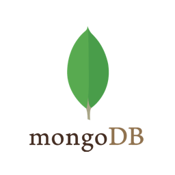
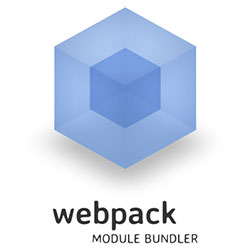

Для работы с приложением на компьютере должны быть установлены следующие программы
- Node.js и npm (https://nodejs.org/en/download/)
- docker (https://docs.docker.com/engine/install/)
- docker-compose (https://docs.docker.com/compose/install/)

Для запуска бэкенд сервера:
1. Перейдите по ссылке https://github.com/Tonia-SE/kigurumi-backend и склонируйте репозиторий
2. Выполните команду npm i
3. Выполните команду npm run populate-db
4. Выполните команду npm run dev

Для запуска фронта:
1. Клонируйте ветку develop текущего репозитория
2. Выполните команду npm i
3. В файловой системе (src/consts.ts) в файле consts.ts раскомментируйте строку 1, закомментируйте строку 2
4. Выполните команду npm run start

Примененный технологический стек:

1. Библиотека React
2. Библиотека Redux
3. Язык программирования TypeScript
4. Программная платформа Node.js
5. Фреймворк web-приложений Express
6. Нереляционная БД MongoDB
7. Сборщик проекта Webpack
8. Автоматизатор развёртывания и управления приложениями Docker
9. Библиотека Bootstrap 4.5.3
10. Препроцессор Sass
11. Линтер Eslint
12. Форматтер кода Prettier
